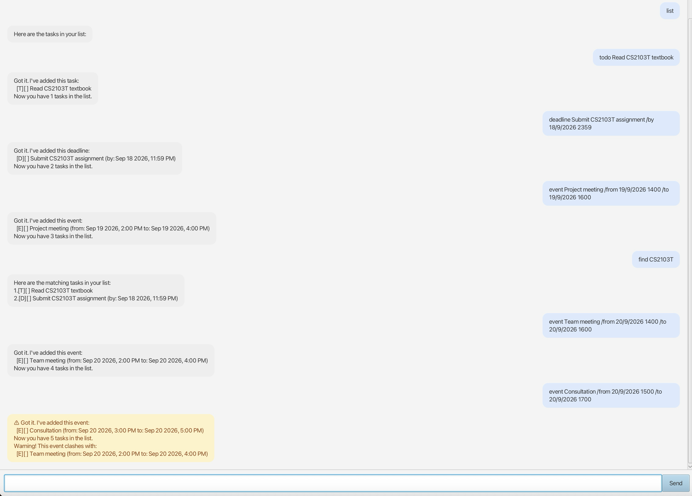

# Nova User Guide



Nova is a desktop task management chatbot that helps you manage your todos, deadlines, and events using simple text commands.

Simply type a command into the input box and press **Enter** or click **Send**.

For commands involving dates and times, use the format:

`d/M/yyyy HHmm`

For example, `18/9/2026 2359` represents **18 September 2026 at 11:59 PM**.

---

## Adding todos

Adds a task without a specific date or time.

Format:

`todo DESCRIPTION`

Example:

`todo Read CS2103T textbook`

Expected outcome:

```text
Got it. I've added this task:
[T][ ] Read CS2103T textbook
```

---

## Adding deadlines

Adds a task that must be completed by a specific date and time.

Format:

`deadline DESCRIPTION /by DATE TIME`

Example:

`deadline Submit assignment /by 18/9/2026 2359`

Expected outcome:

```text
Got it. I've added this task:
[D][ ] Submit assignment (by: Sep 18 2026, 11:59 PM)
```

---

## Adding events

Adds an event with a start and end time.

Format:

`event DESCRIPTION /from DATE TIME /to DATE TIME`

Example:

`event Project meeting /from 19/9/2026 1400 /to 19/9/2026 1600`

Expected outcome:

```text
Got it. I've added this task:
[E][ ] Project meeting
(from: Sep 19 2026, 2:00 PM to: Sep 19 2026, 4:00 PM)
```

Nova will also warn you if a newly added event overlaps with an existing event.

For example, if the following event already exists:

`event Project meeting /from 19/9/2026 1400 /to 19/9/2026 1600`

and you enter:

`event Consultation /from 19/9/2026 1500 /to 19/9/2026 1700`

Nova will warn you that the events clash.

---

## Listing tasks

Displays all tasks currently stored in Nova.

Format:

`list`

Example:

`list`

Expected outcome:

```text
Here are the tasks in your list:
1.[T][ ] Read CS2103T textbook
2.[D][ ] Submit assignment (by: Sep 18 2026, 11:59 PM)
3.[E][ ] Project meeting
```

The number beside each task can be used with commands such as `mark`, `unmark`, and `delete`.

---

## Marking a task as done

Marks a task as completed.

Format:

`mark NUMBER`

Example:

`mark 1`

Expected outcome:

```text
Nice! I've marked this task as done:
[T][X] Read CS2103T textbook
```

---

## Unmarking a task

Marks a completed task as not completed.

Format:

`unmark NUMBER`

Example:

`unmark 1`

Expected outcome:

```text
OK, I've marked this task as not done yet:
[T][ ] Read CS2103T textbook
```

---

## Finding tasks

Finds tasks whose descriptions contain a given keyword.

Format:

`find KEYWORD`

Example:

`find assignment`

Expected outcome:

```text
Here are the matching tasks:
1.[D][ ] Submit assignment (by: Sep 18 2026, 11:59 PM)
```

---

## Deleting tasks

Deletes a task from Nova using its task number.

Format:

`delete NUMBER`

Example:

`delete 2`

Expected outcome:

```text
Noted. I've removed this task:
[D][ ] Submit assignment (by: Sep 18 2026, 11:59 PM)
```

Use the `list` command first if you are unsure of the task number.

---

## Exiting Nova

Exits the application.

Format:

`bye`

Example:

`bye`

Expected outcome:

```text
Bye. Hope to see you again soon!
```

---

## Command Summary

| Action | Format | Example |
| --- | --- | --- |
| Add a todo | `todo DESCRIPTION` | `todo Read book` |
| Add a deadline | `deadline DESCRIPTION /by DATE TIME` | `deadline Submit report /by 18/9/2026 2359` |
| Add an event | `event DESCRIPTION /from DATE TIME /to DATE TIME` | `event Meeting /from 19/9/2026 1400 /to 19/9/2026 1600` |
| List tasks | `list` | `list` |
| Mark a task | `mark NUMBER` | `mark 1` |
| Unmark a task | `unmark NUMBER` | `unmark 1` |
| Find tasks | `find KEYWORD` | `find book` |
| Delete a task | `delete NUMBER` | `delete 2` |
| Exit Nova | `bye` | `bye` |

---

## Saving your tasks

Nova automatically saves your tasks to local storage.

Your tasks will be loaded again the next time you start Nova, so you do not need to manually save your task list.s